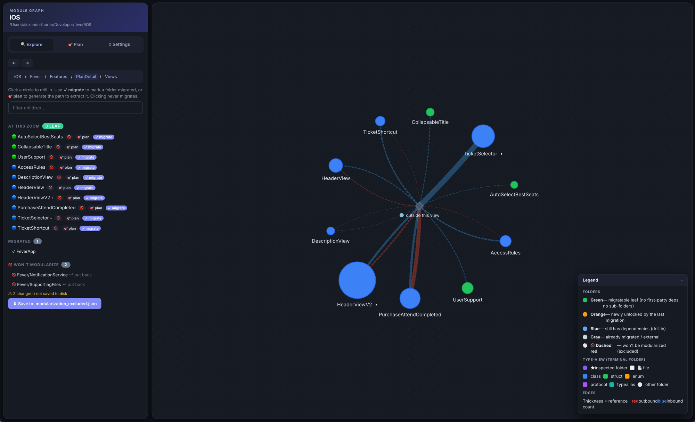

<div align="center">

# 📦 ios-module-graph

**An accurate, folder-level Swift dependency graph + SPM-migration planner — built from the compiler's own index store.**

[](https://swift.org)
[](https://www.python.org)
[](https://github.com/casey/just)
[](#requirements)



</div>

---

Point it at **any** iOS/Swift project. It builds the project once to populate the
compiler index store, resolves every type reference **by USR**, and gives you:

- 🕸️ **An interactive HTML graph** — drill into folders, then into individual **types**, and see real reference edges.
- 🗺️ **A migration plan** — a topologically-ordered, PR-sized path for extracting folders into SPM packages.
- ✅ **Auto-detected progress** — folders already in SPM (any `Package.swift` subtree, found recursively) are marked done and stop blocking the plan.
- 🔍 **Two modes** — *Explore* to understand the codebase, *Migration* to plan and execute the SPM split (with a guided **setup wizard**).
- 🌳 **Call-tree popups & type-level view** — open any folder/file/type in a focused reference tree, or drill a folder down to which of its types are extractable now vs. blocked.
- 🎯 **Preview & retarget** — preview a migration step in the graph and reassign its folders to new or existing SPM packages/targets before you commit.
- 🤖 **Ready-to-paste Claude prompts** — generate a migration prompt for the planned moves (code + tests), or an investigation prompt that asks Claude to recommend the destination package/module.
- ⚡ **Live mode** — serve the graph on localhost, hot-reload it on every rebuild, and `cmd`+click a node to jump straight into Xcode.

> **Edges are real.** A regex scanner can't tell which `Foo` a reference binds to
> when several folders declare a type named `Foo`, so it fabricates edges. This
> tool reads the index store Apple's compiler writes during a build and resolves
> every reference to the **exact** declaration by USR — no phantom edges.

---

## 🚀 Quick start

```sh
# 1. install the task runner
brew install just

# 2. point it at your project (gitignored — never committed)
cat > .env <<'ENV'
PROJECT_DIR=$HOME/path/to/MyApp
WORKSPACE=MyApp.xcworkspace   # optional — auto-detected if unset
SCHEME=MyApp                  # optional — auto-detected if unset
ENV

# 3. build the graph
just tree
```

The first run builds your project, indexes it, and opens
`dependency_graph.html`. Subsequent runs are instant.

---

## 🛠️ Commands

| Command | Output |
|---------|--------|
| `just tree` | interactive HTML graph → `dependency_graph.html` |
| `just list` | migration task list → `migration_plan.md` |
| `just all` | both |
| `just serve` | live mode — serve the HTML, hot-reload on rebuild, `cmd`+click → Xcode |
| `just clean` | wipe generated files (forces a full rebuild next run) |

`tree`/`list`/`all` reuse the resolved graph (`index_graph.json`) from the last
run, so re-rendering is instant. It's rebuilt automatically when missing — the
first run, or after `just clean`. **To force a rebuild from zero:**

```sh
just clean && just tree
```

**Per-run overrides** — every `.env` key is also a `just` CLI var (CLI wins):

```sh
just tree project_dir=/other/App workspace=Other.xcworkspace scheme=Other
```

---

## 🖼️ Reading the graph

Each circle is a **folder**; size scales with how much it contains. Click to
drill in, or jump to the **Plan** tab to generate an extraction path.

| | Node | Meaning |
|---|------|---------|
| 🟢 | **Green** | migratable leaf — no first-party deps, no sub-folders. **Start here.** |
| 🟠 | **Orange** | newly unlocked by the last migration |
| 🔵 | **Blue** | still has dependencies — drill in |
| ⚪ | **Gray** | already migrated / external |

Edge **thickness** = number of references. **Red** = outbound, **blue** = inbound.
A **dashed red** edge marks a folder you've flagged *won't be modularized*.

---

## 🧭 Modes & tools

A toggle at the top switches the whole UI between two modes:

- **🔍 Explore** — understand the codebase. Every folder is neutral-colored; migration state is hidden so it doesn't get in the way. Already-SPM folders stay in scope so you can see SPM-to-SPM coupling.
- **🧭 Migration** — plan and execute the split. Adds a **Setup** wizard, a **Plan** tab, and per-node migration state (leaf / blocked / migrated / won't-modularize).

Tools available while exploring or planning:

- **Type-level drill-down** — click into a folder to see its individual types as a graph. Each type is colored by whether it's **extractable now** (no external deps), **moves with the folder** (only intra-folder refs), or **blocked** (depends on other folders).
- **🌳 Call tree** — open any folder, file, or type in a focused popup that renders its reference tree in its own graph, so you can trace what pulls in what without losing your place.
- **🔍 Preview & retarget** — from a plan step, preview the affected folders in the graph and reassign them to a **new or existing SPM package/target** before committing to the move.
- **🤖 Prompt generators** — once a step is scoped, generate a ready-to-paste **Claude prompt**:
  - *migration prompt* — describes every move in the step (including relocating tests into the new module's test target).
  - *investigation prompt* — when you don't yet know the destination, asks Claude to inspect the repo (with dependency context attached) and recommend the package, module name, and approach first.

---

## ⚡ Live mode

```sh
just serve            # serves dependency_graph.html on http://localhost:8765
```

`just serve` hosts the graph locally and **hot-reloads** it whenever `just tree`
regenerates the HTML — so in another terminal you can edit code, re-run
`just tree`, and watch the graph update. `cmd`/`ctrl`+click a folder, file, or
type to **open it in Xcode** (via `xed`). Stays running until `Ctrl-C`; override
the port with `just serve port=9000`.

---

## ⚙️ Build modes

`BUILD_MODE` (env or CLI var) selects how the project is built to populate the
index store:

| Mode | When | Build command |
|------|------|---------------|
| `auto` *(default)* | — | `.xcworkspace`/`.xcodeproj` present ⇒ `xcode`; else `Package.swift` ⇒ `spm` |
| `xcode` | Xcode-managed project | `xcodebuild clean build -workspace/-project -scheme` |
| `spm` | pure SwiftPM package | `swift build` |

The build runs arm64-only against an iOS simulator destination. A non-zero build
exit is **tolerated** as long as the index store populated — indexing finishes
before linking, so link errors don't block analysis. A real compile failure
leaves the store empty and hard-fails.

Need extra build flags? (e.g. an iOS SDK/target for a pure-SPM build of UIKit code)

```sh
SWIFT_BUILD_FLAGS="-Xswiftc -sdk -Xswiftc $(xcrun --sdk iphonesimulator --show-sdk-path)"
XCODE_BUILD_FLAGS="-quiet"
CONFIG=Release
DEST="generic/platform=iOS Simulator"
```

---

## 📋 Requirements

| Tool | Why | Notes |
|------|-----|-------|
| [`just`](https://github.com/casey/just) | task runner | `brew install just` |
| Swift 6.x toolchain | builds the index-store reader | ships with Xcode |
| Python 3 | renders the HTML / task list | stdlib only, no pip deps |
| Xcode + `xcodebuild` | builds the target project (xcode mode) | only for `.xcworkspace`/`.xcodeproj` |
| `xcsift` | formats `xcodebuild` output | only used in xcode mode |

The reader depends on `apple/indexstore-db` (`release/6.3`), fetched once on
first build. If it fails to resolve, match the branch to your toolchain in
`index_graph/Package.swift`.

---

## 🧩 How it works

```
                     just tree
                        │
   ┌────────────────────┼─────────────────────────────────────┐
   │ 1. build target project (xcodebuild | swift build)        │
   │    → populates the compiler index store                   │
   ├───────────────────────────────────────────────────────────┤
   │ 2. index_graph (Swift)  reads the store, resolves every    │
   │    reference by USR → index_graph.json                     │
   ├───────────────────────────────────────────────────────────┤
   │ 3. find_leaf_modules.py  builds the folder graph, computes │
   │    an SCC-aware topological migration order →              │
   │    dependency_graph.html / migration_plan.md               │
   └───────────────────────────────────────────────────────────┘
```

The migration plan is **SCC-aware**: folders that are cyclically coupled are
bundled into a single step (you can't extract them independently). It shows
"start here → next → next" guidance and which prerequisites must move first.
