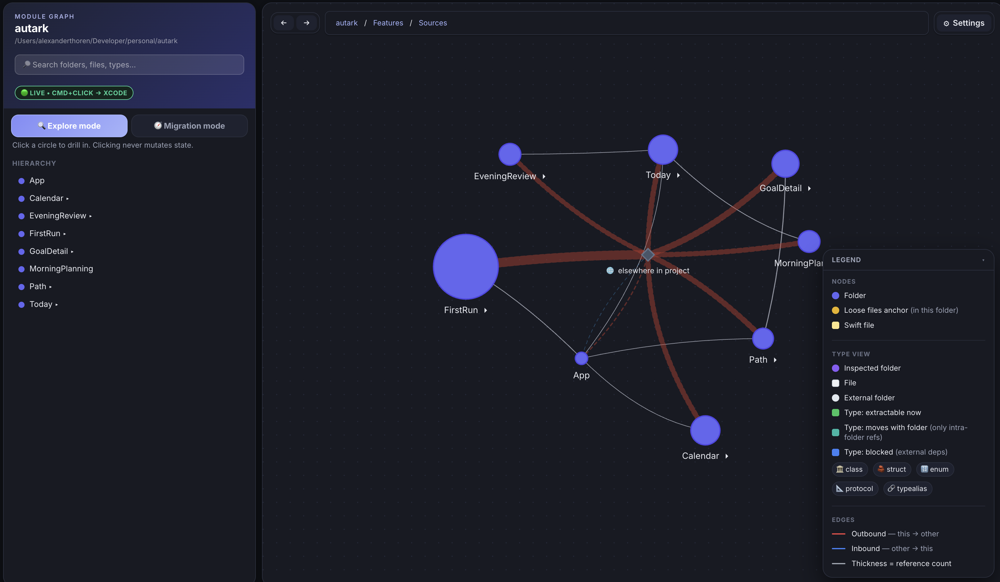
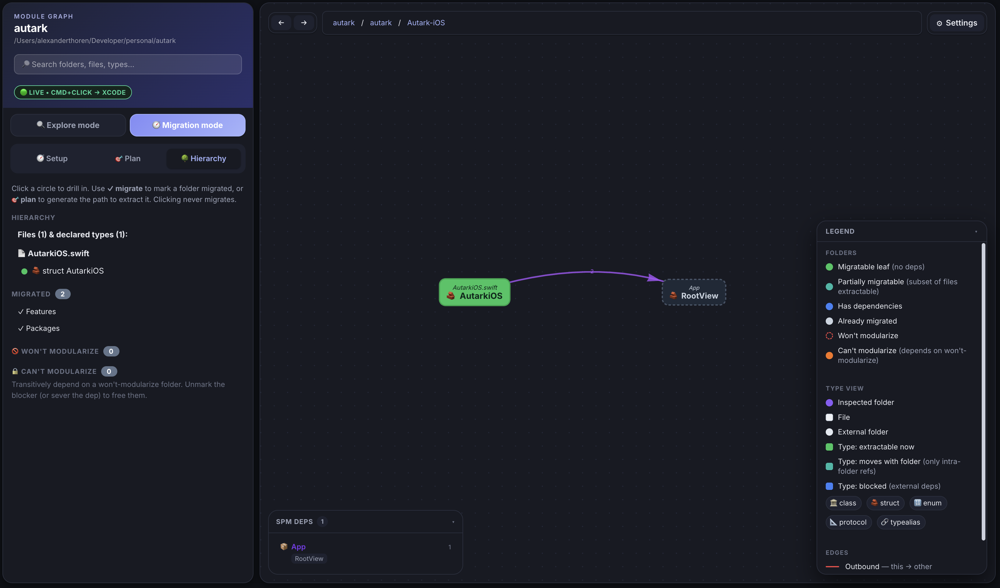
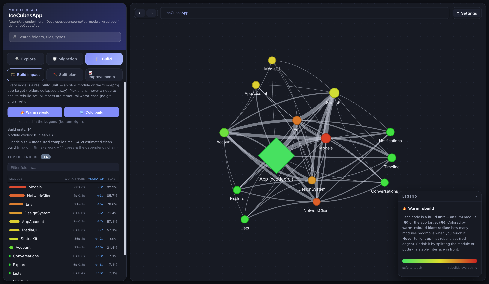

<div align="center">

# 📦 ios-module-graph

**An accurate, folder-level Swift dependency graph + SPM-migration planner — built from the compiler's own index store.**

[](https://swift.org)
[](https://www.python.org)
[](https://github.com/casey/just)
[](#requirements)





</div>

---

Point it at **any** iOS/Swift project. It builds the project once to populate the
compiler index store, resolves every type reference **by USR**, and gives you:

- 🕸️ **An interactive HTML graph** — drill into folders, then into individual **types**, and see real reference edges.
- 🗺️ **A migration plan** — a topologically-ordered, PR-sized path for extracting folders into SPM packages.
- ✅ **Auto-detected progress** — folders already in SPM (any `Package.swift` subtree, found recursively) are marked done and stop blocking the plan.
- 🔍 **Three modes** — *Explore* to understand the codebase, *Migration* to plan and execute the SPM split (with a guided **setup wizard**), *Build* to see what every module costs your build and what to split next.
- ⏱️ **Real compile times** — captured for free from the index build via the compiler's `-stats-output-dir`, so Build mode ranks split payoffs in measured seconds, not guesses.
- 🌳 **Call-tree popups & type-level view** — open any folder/file/type in a focused reference tree, or drill a folder down to which of its types are extractable now vs. blocked.
- 🎯 **Preview & retarget** — preview a migration step in the graph and reassign its folders to new or existing SPM packages/targets before you commit.
- 🤖 **Ready-to-paste Claude prompts** — generate a migration prompt for the planned moves (code + tests), or an investigation prompt that asks Claude to recommend the destination package/module.
- ⚡ **Live mode** — serve the graph on localhost, hot-reload it on every rebuild, and `cmd`+click a node to jump straight into Xcode.

> **Edges are real.** A regex scanner can't tell which `Foo` a reference binds to
> when several folders declare a type named `Foo`, so it fabricates edges. This
> tool reads the index store Apple's compiler writes during a build and resolves
> every reference to the **exact** declaration by USR — no phantom edges.

**🚀 [Try the live demo](https://alexanderthoren.github.io/ios-module-graph/)** — the
graph of [IceCubesApp](https://github.com/Dimillian/IceCubesApp), a real,
heavily-modularized open-source Mastodon client, regenerated weekly by CI.
Nothing to install.

---

## 🚀 Quick start

```sh
# 1. install the task runner
brew install just

# 2. point it at your project (gitignored — never committed)
cat > .env <<'ENV'
PROJECT_DIR=$HOME/path/to/MyApp
WORKSPACE=MyApp.xcworkspace   # optional — auto-detected if unset
SCHEME=MyApp                  # optional — auto-detected if unset
ENV

# 3. build the graph
just tree
```

The first run builds your project, indexes it, and writes
`out/MyApp/dependency_graph.html`. Subsequent runs are instant.

---

## 🛠️ Commands

| Command | Output |
|---------|--------|
| `just tree` | interactive HTML graph → `out/<Project>/dependency_graph.html` |
| `just list` | migration task list → `out/<Project>/migration_plan.md` |
| `just all` | both |
| `just refresh` | fast loop — re-index from an **incremental** build (no clean), re-render |
| `just serve` | live mode — serve the HTML, hot-reload on rebuild, `cmd`+click → Xcode |
| `just test` | run the Python test suite (stdlib unittest) |
| `just clean` | wipe the current project's generated files (forces a full rebuild next run) |

Everything generated lands in a **per-project workspace** —
`out/<project basename>/` (override with `OUT_DIR`) — so you can analyze several
projects side by side without clobbering each other's cache or history. Files
from a pre-`out/` checkout are migrated there automatically on the next run.

`tree`/`list`/`all` reuse the resolved graph (`index_graph.json`) from the last
run, so re-rendering is instant. It's rebuilt automatically when missing — the
first run, or after `just clean`. The cached graph records which commit of your
project it was indexed at; if the repo has moved on (or has uncommitted
changes) `tree`/`list`/`all` **auto-refresh** it incrementally before rendering,
so you never silently analyze an old world. Prefer the old behavior — reuse the
stale graph and just print a warning (e.g. in CI, or on a project where even an
incremental build is slow)? Set `AUTO_REFRESH=0`. **To force a rebuild from
zero:**

```sh
just clean && just tree
```

For the edit → re-check loop there's a faster path: **`just refresh`** rebuilds
incrementally (only changed files recompile), re-reads the index store, and
re-renders — minutes become seconds-to-a-minute on big projects. Compile
*times* are deliberately kept from the last cold build (an incremental build
only times what it recompiled), and deleted files can linger in the index until
the next clean run; the graph's edges and commit stamp are fully fresh.

**Per-run overrides** — every `.env` key is also a `just` CLI var (CLI wins):

```sh
just tree project_dir=/other/App workspace=Other.xcworkspace scheme=Other
```

---

## 🧭 Modes & tools

A toggle at the top switches the whole UI between three modes:

- **🔍 Explore** — understand the codebase. Every folder is neutral-colored; migration state is hidden so it doesn't get in the way. Already-SPM folders stay in scope so you can see SPM-to-SPM coupling.
- **🧭 Migration** — plan and execute the split. Adds a **Setup** wizard, a **Plan** tab, a **⚡ Quick wins** tab, and per-node migration state (leaf / blocked / migrated / won't-modularize).
- **🏗️ Build** — find build-time wins. Forgets folders and shows the real compile units (SPM targets + the app target) with warm/cold cost lenses, a split-payoff ranking, and a build-cost history. See *Build mode* below.

Tools available while exploring or planning:

- **Type-level drill-down** — click into a folder to see its individual types as a graph. Each type is colored by whether it's **extractable now** (no external deps), **moves with the folder** (only intra-folder refs), or **blocked** (depends on other folders).
- **🌳 Call tree** — open any folder, file, or type in a focused popup that renders its reference tree in its own graph, so you can trace what pulls in what without losing your place.
- **🔍 Preview & retarget** — from a plan step, preview the affected folders in the graph and reassign them to a **new or existing SPM package/target** before committing to the move.
- **🤖 Prompt generators** — once a step is scoped, generate a ready-to-paste **Claude prompt**:
  - *migration prompt* — describes every move in the step (including relocating tests into the new module's test target).
  - *investigation prompt* — when you don't yet know the destination, asks Claude to inspect the repo (with dependency context attached) and recommend the package, module name, and approach first.
- **⚡ Quick wins** — every in-scope folder ranked by **ROI**: payoff (warm blast radius = unblocking power, cold critical-path contribution, weighted by git churn) over effort (files + refs to refactor + types going `public`). Rows extractable **today** carry the auto-picked **absorb-into-existing-module** destination (folding into an existing SPM module is the default outcome; a new target the exception). Blocked rows expand to the exact references to sever, each classified with a suggested fix — *move file*, *push the shared type down*, or *invert with a protocol*. A **Misplaced files** section on top lists single-file moves (the smallest PRs of all) that dissolve fake folder coupling, with a copy-paste agent prompt each. The plan list shows the same signals as 🌊 wave (parallelizable cohort) and ⚡ ROI badges per step.
- **🏗 Level-aware destinations** — the absorb auto-pick respects build layering, not just reference counts. A destination is **vetoed** when absorbing would *raise its build level* (the folder depends on a module at or above it — feature code must not drag a low-level module upward) or when it's *churn-hostile* (a hot folder into a widely-depended-on module makes every consumer pay the churn on warm rebuilds). Vetoes are hard but auditable: each row lists the rejected candidates with reason and evidence, so overriding is a deliberate act. Every row also carries a 🏗 **lands L*y*** badge: today the code compiles inside the app target — the *top* of the build graph — and every extraction moves it down; the badge says how far it gets (the destination's level for absorbs, its own-module landing otherwise) and which dependency **pins** its floor ("pinned by Containers" means it can't land lower until that reference is cut or that module is split). Blocked rows get the projection too: "fix the cut-set and this lands at L1" is the motivation for the cut. ROI ties rank lower landings first — same payoff-per-effort, but one builds the foundation.
- **🪓 Module splits** — existing SPM modules whose **level spread** says a low-level core is trapped inside: the module sits at L5 because one unit imports a heavy SDK, while its other units would be L0 on their own. The section lists each module's units with their *intrinsic level*, which consumers touch only the low units (they could retarget and drop their dependency height), and the public-API cost of the split.
- **📝 Review prompts** — every quick-win row and split candidate has a copy-paste **architecture-review prompt**: all the graph evidence (cut-set, files, levels, churn, destination rationale, vetoed alternatives) addressed to a reviewer — human or Claude — whose job is the one thing the graph can't see: domain cohesion and naming. **REJECT is a first-class verdict**; the tool never modularizes for its own sake.
- **✂️ Divide into modules** — hover any folder big enough to split and hit **Divide**. It treats the folder's immediate subfolders as candidate sub-modules and shows a **public-API cost** table (how many types each sub-module would expose as `public`) and an **SCC-aware extraction order**. Each step has a **📊 Visualize** before/after graph and a **📋 Copy prompt** button that builds a ready-to-paste Claude prompt for that step. See *Divide a module* below.

---

## ✂️ Divide a module

The migration plan extracts whole folders of the app into SPM. **Divide** does the
inverse-scale job: you already have a module that grew too big — how do you split
*it* into smaller modules? It lives entirely in the HTML graph — hover a folder
node and hit **Divide**.

Candidate sub-modules are the module's **immediate subfolders**. For each it
computes the **public-API surface** — the types referenced from another
sub-module, which must flip `internal`→`public` once the boundary is a module
boundary. A near-zero percentage is a clean extraction; a high one means the
folder is glue that leaks most of its types and splitting it buys little. The
extraction order bundles cyclically-coupled sub-modules into one step and lists
the feedback-arc-set edges to sever before they can become separate modules.

Per extraction step you get:

- **📊 Visualize** — a before/after graph of the sub-module units. *Before* shows
  the current coupling with the edges this step must cut in red; *after* shows the
  step's units extracted (green), those edges removed, and surviving references
  redrawn as cross-module imports (blue).
- **📋 Copy prompt** — a ready-to-paste Claude prompt for that step. Leaf steps get
  an **extraction** prompt (which files to move, which types become `public`, which
  consumers to update). Cycle bundles get a **refactor** prompt (the exact
  references to sever to break the cycle — a cyclic bundle can't be moved as-is).

Requires the index path (the public-API cost needs the USR-resolved references),
so the Divide action only appears when the graph was built from the index store.

---

## 🏗️ Build mode

A folder is not a compile unit — only **SPM targets** and the **app target** are.
Build mode forgets folders, collapses the graph to the modules the compiler
actually builds, and shows what your build pays for each of them. It answers the
inverse of Migration mode's question: not "what *can* move next?" but **"what
should move next to make builds faster?"**

Two lenses, toggleable in place:

- **🔥 Warm** — *change cost*. Touch a module → how many modules recompile (its
  transitive reverse-dependents). A worst-case upper bound, since Swift only
  cascades rebuilds on public-interface changes.
- **❄️ Cold** — *clean-build shape*. Modules grouped into parallelizable build
  levels, with the **critical path** — the dependency chain that bounds the
  clean-build wall — highlighted.

Hover any module to light up its **rebuild set** (everything that recompiles when
it changes). A side-effect of module granularity: folder-level cycles vanish —
they're intra-module, and a module compiles atomically — so the graph reflects
the real build topology.

### Split plan

Modules **ranked by the build-time payoff of splitting them**, scored on two
levers: a *warm* lever (the summed compile cost of everything that recompiles
when the module changes — splitting localizes edits) and a *cold* lever (the
module's own compile cost *if* it sits on the critical path — splitting a big
serial module lets its pieces build in parallel). Each row carries the matching
action: SPM targets big enough to split link straight to **✂️ Divide**, the app
target points at Migration mode, and flat modules get "stabilize the public
API". Hovering a row highlights that module's rebuild set in the live graph.

### Improvements

Build cost **over time** — did the last extraction actually pay off? Every
render appends one snapshot to `build_history.jsonl`, deduped and keyed to the
target project's git commit, so you get one row per real change. The file
**deliberately survives `just clean`** — tracking improvement *across*
extractions is the point. The tab renders before/after headline cards,
per-metric sparklines, and a per-commit delta table. Structural metrics
(modules, edges, coupling, critical-path length) are deterministic — the honest
improvement signal; wall-clock estimates are measured and noisy (flagged `~` —
direction, not proof).

The loop: extract a module → `just clean && just tree` → check Improvements.

### Real compile times

Module cost defaults to a declared-type-count proxy, but the index build
captures **real per-module compile times for free**: it builds with the Swift
compiler's `-stats-output-dir`, then aggregates the per-file wall times into
`build_times.json` (plus a `build_floors.json` sidecar — each module's longest
single file, its serial floor). When present, node sizes, split rankings, and
the clean-build estimate are all in **measured seconds** (the UI labels
"measured" vs "estimated").

Three different numbers, deliberately kept apart: per-module **work** (summed
CPU seconds across its files — parallelizes across cores, so *not* wall-clock),
the estimated **clean-build wall** (`max(total work ÷ cores, longest dependency
chain)`), and per-module **cold wall** (the from-scratch time to build the
module *and* its transitive deps). The sidebar and tooltips spell out which is
which.

---

## ⚡ Live mode

```sh
just serve            # serves dependency_graph.html on http://localhost:8765
```

`just serve` hosts the graph locally and **hot-reloads** it whenever `just tree`
regenerates the HTML — so in another terminal you can edit code, re-run
`just tree`, and watch the graph update. `cmd`/`ctrl`+click a folder, file, or
type to **open it in Xcode** (via `xed`). Stays running until `Ctrl-C`; override
the port with `just serve port=9000`.

---

## 🔬 Diff two graphs

```sh
just diff before.json out/MyApp/index_graph.json     # human-readable markdown
python3 -m modgraph.diff old.json new.json --format json --exit-code
```

Compare two saved `index_graph.json` snapshots — main vs a PR branch, or before
vs after an extraction — and get exactly what changed in the architecture:
folders and edges added/removed (every new edge annotated with the **type
references that explain it**), and **cycles formed or broken**. Each side is
labelled with the commit it was indexed at, so the report says *which two
states* it compares.

Typical loop: copy `out/<Project>/index_graph.json` aside before a refactor,
re-index afterwards, diff the two. `--exit-code` exits 1 on any structural
change (git-diff convention) for scripting; the output is deterministic, so
reports diff cleanly themselves.

---

## 🛡️ Architecture gate (CI)

```sh
just check out/MyApp/index_graph.json --max-cycles 0 --forbid 'Features/* -> Legacy/*'
python3 -m modgraph.check new.json --against baseline.json --no-new-edges --no-new-cycles
```

Where `diff` reports, `check` **judges**: exit 1 plus a readable report when
the graph violates the rules — a standing guardrail for teams mid-migration.

- **Absolute rules** need only the current graph: `--max-cycles N`, and
  repeatable `--forbid 'SRC -> DST'` (fnmatch globs over folder paths; `*`
  crosses `/`). Every forbidden edge is reported with the type references that
  cause it.
- **Ratchet rules** tolerate existing coupling and fail only on *additions*
  relative to a baseline (`--against old.json`): `--no-new-edges`,
  `--no-new-cycles`.

Generating `index_graph.json` requires a macOS build of the target project, so
a practical setup is: a nightly job indexes `main` and stores the JSON as the
baseline artifact; PR jobs index only the PR branch and run `check --against`
it.

---

## ⚙️ Build modes

`BUILD_MODE` (env or CLI var) selects how the project is built to populate the
index store:

| Mode | When | Build command |
|------|------|---------------|
| `auto` *(default)* | — | `.xcworkspace`/`.xcodeproj` present ⇒ `xcode`; else `Package.swift` ⇒ `spm` |
| `xcode` | Xcode-managed project | `xcodebuild clean build -workspace/-project -scheme` |
| `spm` | pure SwiftPM package | `swift build` |

The build runs arm64-only against an iOS simulator destination. A non-zero build
exit is **tolerated** as long as the index store populated — indexing finishes
before linking, so link errors don't block analysis. A real compile failure
leaves the store empty and hard-fails.

Need extra build flags? (e.g. an iOS SDK/target for a pure-SPM build of UIKit code)

```sh
SWIFT_BUILD_FLAGS="-Xswiftc -sdk -Xswiftc $(xcrun --sdk iphonesimulator --show-sdk-path)"
XCODE_BUILD_FLAGS="-quiet"
CONFIG=Release
DEST="generic/platform=iOS Simulator"
```

---

## 📋 Requirements

| Tool | Why | Notes |
|------|-----|-------|
| [`just`](https://github.com/casey/just) | task runner | `brew install just` |
| Swift 6.x toolchain | builds the index-store reader | ships with Xcode |
| Python 3 | renders the HTML / task list | stdlib only, no pip deps |
| Xcode + `xcodebuild` | builds the target project (xcode mode) | only for `.xcworkspace`/`.xcodeproj` |
| `xcsift` | formats `xcodebuild` output | optional — raw output when absent |

The reader depends on `apple/indexstore-db` (`release/6.3`), fetched once on
first build. If it fails to resolve, match the branch to your toolchain in
`index_graph/Package.swift`.

---

## 🧩 How it works

```
                     just tree
                        │
   ┌────────────────────┼─────────────────────────────────────┐
   │ 1. build target project (xcodebuild | swift build)        │
   │    → populates the compiler index store                   │
   ├───────────────────────────────────────────────────────────┤
   │ 2. index_graph (Swift)  reads the store, resolves every    │
   │    reference by USR → index_graph.json                     │
   ├───────────────────────────────────────────────────────────┤
   │ 3. modgraph (Python)  builds the folder graph, computes    │
   │    an SCC-aware topological migration order →              │
   │    dependency_graph.html / migration_plan.md               │
   └───────────────────────────────────────────────────────────┘
```

The migration plan is **SCC-aware**: folders that are cyclically coupled are
bundled into a single step (you can't extract them independently). It shows
"start here → next → next" guidance and which prerequisites must move first. The
plan, graph, and package map are **deterministic** — identical inputs always
produce byte-identical outputs, so regenerating after a change yields a clean diff.

---

## 🗂️ Project layout

```
index_graph/            Stage 1 — Swift index-store reader (SwiftPM)
  Sources/index_graph/main.swift   resolves refs by USR → index_graph.json
modgraph/               Stage 2 — Python package (stdlib only)
  config.py             constants, regexes, default paths
  models.py             GraphData — the typed graph container
  scanner.py            regex-scan fallback (no index store)
  index_loader.py       load the USR-resolved index_graph.json
  graph.py              Tarjan SCC, SCC-aware migration plan, folder tree
  cycles.py             feedback-arc-set + per-folder extraction targets
  spm.py                SPM package map + migrated-prefix auto-detection
  exclusions.py         "won't modularize" set + transitive blocked-by
  tasks.py              flatten the plan into PR-sized tasks; md / json writers
  render.py             inject the payload into templates/template.html
  cli.py                argument parsing + main orchestration
  __main__.py           `python3 -m modgraph` entry point
  serve.py              companion HTTP server for `just serve` (live mode)
  templates/
    template.html       the interactive HTML+JS UI
justfile                the glue: build → index → resolve → render
tests/                  stdlib-unittest suite for the modgraph package
```

---

## 🧑‍💻 Direct CLI

`just` is the easy path, but the Python stage is a normal CLI you can drive
directly (this is what the recipes call).

```sh
python3 -m modgraph <project_root> [options]
```

| Option | Effect |
|--------|--------|
| `--from-index JSON` | load the USR-resolved graph from `index_graph.json` (the accurate path) instead of regex-scanning |
| `--graph [PATH]` | write the interactive HTML graph (default `dependency_graph.html`; implied if neither `--graph` nor `--list` is given) |
| `--list [PATH]` | write the migration task list (default `migration_plan.md`) |
| `--list-format markdown\|json` | task-list format (default `markdown`) |
| `--migrated-prefix PREFIX` | mark a path prefix as already-in-SPM (repeatable; auto-detected from `Package.swift` subtrees) |
| `--no-auto-detect-spm` | disable `Package.swift` auto-detection |
| `--excluded-file JSON` | folders flagged *won't be modularized* (the graph's Exclude button writes this) |
| `--include-tests` | include `Tests`/`UITests`/`SnapshotTests` folders (skipped by default) |
| `--ignore PATTERN` | glob to skip, matched against dir name **or** relative path (repeatable) |
| `--label NAME` | display label for the root (default: directory basename) |
| `--ext .swift` | file extension to scan (only Swift is fully supported) |

Without `--from-index` the tool falls back to a pure regex scan — fast, but it
fabricates edges when two folders declare a same-named type. Prefer the index
path; that's the reason stage 1 exists.

---

## 🧪 Development

The Python package has a stdlib-`unittest` suite — **no pip dependencies**:

```sh
just test                                    # whole suite (alias: just tests)
python3 -m unittest discover -s tests -v     # whole suite (from repo root)
python3 -m unittest tests.test_graph -v      # a single module
```

`tests/fixtures.py` defines one shared toy project the tests assert against;
`tests/test_graph.py` is the style exemplar. There is no linter — verification is
a green test run plus a clean `just tree` regeneration.
